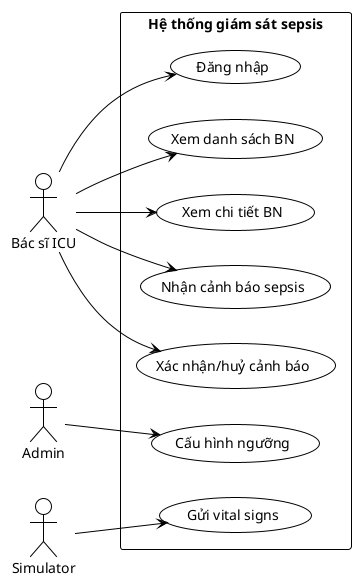
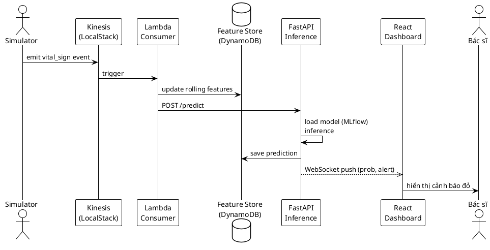
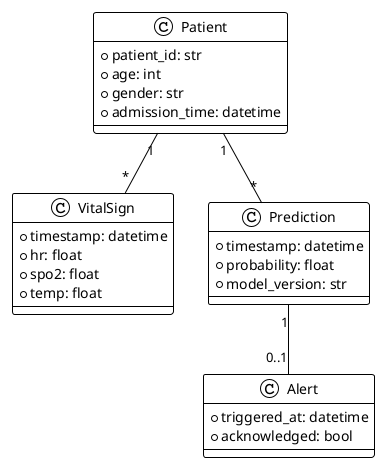

# Skill: New UML Diagram

Tạo file PlantUML (`.puml`) mới trong `docs/uml/` theo loại biểu đồ user yêu cầu. Luôn kèm ví dụ tham khảo từ bối cảnh đồ án (sepsis, ICU, streaming).

## Quy trình

1. Hỏi user loại biểu đồ (nếu chưa rõ): use case / sequence / class / activity / ER / component / data-flow.
2. Hỏi scope (nếu chưa rõ): module nào? Actor nào?
3. Tạo file `docs/uml/NN-<tên>.puml` (NN = số thứ tự theo báo cáo, vd `04-sequence-sepsis-detection.puml`).
4. Viết PlantUML code đúng syntax. Dùng skinparam tối thiểu cho đẹp.
5. Thêm comment đầu file: mục đích biểu đồ, thuộc mục nào của báo cáo (2.1-2.8).
6. Nếu project chưa có `docs/uml/README.md`, tạo luôn với hướng dẫn render (`plantuml -tpng *.puml`).

## Template tham khảo

### Use case

### Sequence

### Class

## Lưu ý

- Đặt tên file rõ ràng: số thứ tự + loại + chủ đề (`02-usecase-doctor.puml`).
- Mỗi file = 1 biểu đồ. Không gộp nhiều biểu đồ vào 1 file.
- Sau khi tạo, nhắc user cách render: `plantuml docs/uml/*.puml` hoặc dùng VSCode extension PlantUML.
